# ParsBERT Sentiment Analysis

In this project, I am using ParsBERT monolingual BERT-based model for persian language sentiment analysis. The authors of ParsBERT article have gathered large persian text corpora and evaluated the NLP downstream tasks on them and compared them with baselines. ParsBERT is available for public use as well as most of the datasets that are mentioned in the article.

**ParsBERT** is a monolingual Persian language model that is fine-tuned and used for text classification, sentiment analysis, and named entity recognition. This repository contains code for sentiment analysis using ParsBERT, implemented in TensorFlow, PyTorch, and Python scripts.

Transformer-based models such as BERT are usually focused on English, leaving other languages to multilingual models with limited resources. The ParsBERT paper proposes a monolingual BERT for the Persian language (ParsBERT), which shows its state-of-the-art performance compared to other architectures and multilingual models.

## Features

* Sentiment analysis of Persian text
* ParsBERT outperforms other Persian language models in sentiment analysis, text classification, and named entity recognition tasks.
* It is based on google's Bidirectional Encoder Representations from Transformer (BERT).

## Data

Since the amount of data available for NLP tasks in Persian is very restricted, a massive dataset for different NLP tasks as well as pretraining the model is composed. Public datasets can be downloaded from the following [links](https://hooshvare.github.io/docs/datasets/tc).

* [Persian Wikidumps](https://dumps.wikimedia.org/fawiki/)

* [MirasText](https://github.com/miras-tech/MirasText)

* [ARMAN](https://bit.ly/3c5hlAK):
        [labels](https://www.kaggle.com/datasets/behnamkhorshidian/persianner?select=arman-labels.txt) and
        [tokens](https://www.kaggle.com/datasets/behnamkhorshidian/persianner?select=arman-tokens.txt)

* [PAYMA](https://bit.ly/36w9VFj)
        [labels](https://www.kaggle.com/datasets/behnamkhorshidian/persianner?select=peyma-labels.txt) and
        [tokens](https://www.kaggle.com/datasets/behnamkhorshidian/persianner?select=peyma-tokens.txt)

* [Digikala user comments provided by Open Data Mining Program](https://www.digikala.com/opendata/)

* [SentiPers](https://github.com/phosseini/sentipers)

* [DeepSentiPers](https://github.com/JoyeBright/DeepSentiPers)

* [SnappFood](https://bit.ly/2Xu2xq1)

* [Digikala Magazine (DigiMag)](https://bit.ly/3ca4bm8)

* [Persian News](https://bit.ly/3d47ood)

* [Taaghche](https://www.kaggle.com/datasets/saeedtqp/taaghche)

Some data is manually crawled from sites and is not publicly available.

* [Digikala](https://www.digikala.com/mag/)

* [BigBang Page](https://bigbangpage.com/)

* [Eligasht](https://www.eligasht.com/Blog/)

* [Ted Talks general](https://www.ted.com/talks)

* [Chetor](https://www.chetor.com/)

* [Books]

I'm going to use one of the sentiment analysis datasets accessible from Kaggle ([Taaghche](https://www.kaggle.com/saeedtqp/taaghche)).

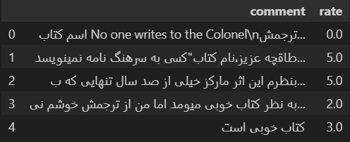

### Fixing Conflicts

The dataset has some structural problems, as shown below.

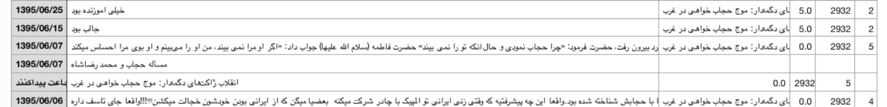

For simplicity, I fix this problem by removing rows with the `rate` value of `None`. Furthermore, the dataset contains duplicated rows and missing values in the comment section.

The dataset information has been shown below:

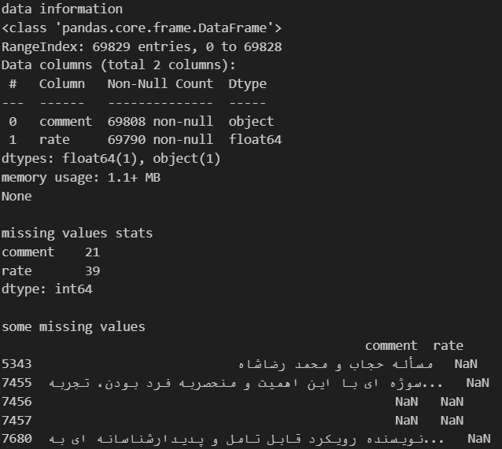

## Preprocessing

### Normalization / Preprocessing

The comments have different lengths based on words! Detecting the most normal range could help us find the maximum length of the sequences for the preprocessing step. On the other hand, we suppose that the minimum word combination for having a meaningful phrase for our learning process is 3.

The distribution of rates within comments is shown in the figure below:

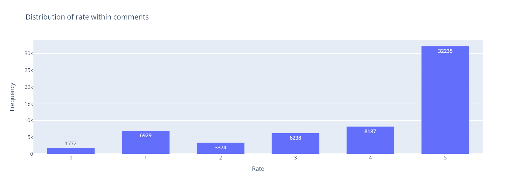

For simplicity, I transformed the rate in a range of 0.0 to 5.0 to a binary form of negative (0) or positive (1) with a threshold. If the rate is less than 3.0, it labeled as negative otherwise specified as positive.

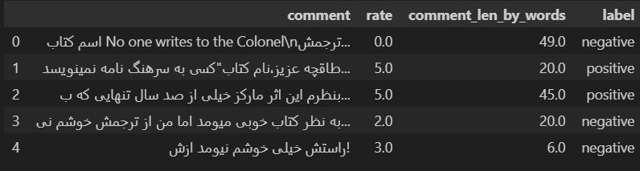

Cleaning is the final step in this section. Our clean method includes these steps:

* fixing unicodes
* removing specials like a phone number, email, url, new lines, ...
* cleaning HTMLs
* normalizing
* removing emojis

Preprocessing is done by removing all the trivial and junk characters and standardizing the corpus with respect to Persian characters.

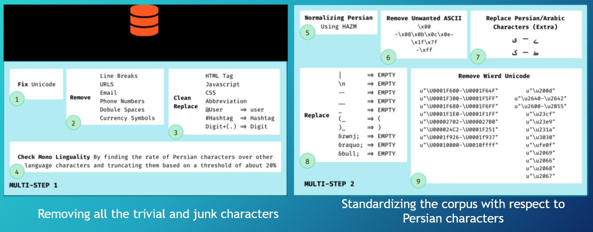

Finally, the cleaned data is shown here:

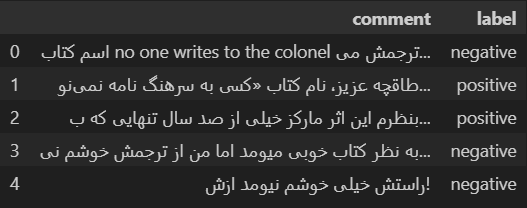

The distribution of labels within comments has shown unbalanced data.

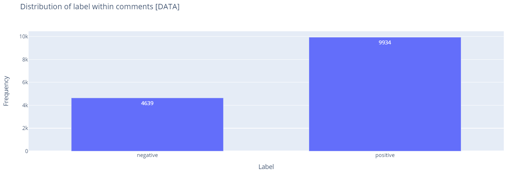

Again, for making things simple. We cut the dataset randomly based on the fewer label, the negative class.

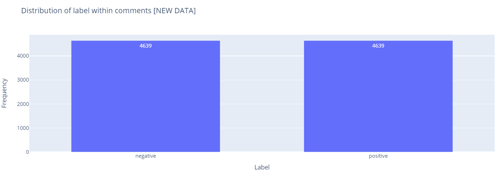

Segmentation is done with POS and WordPiece.

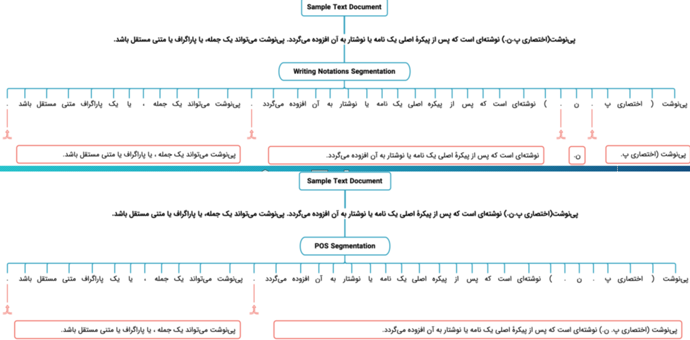

### Train,Validation,Test split

To achieve a globalized model, we need to split the cleaned dataset into train, valid, test sets due to size of the data. In this tutorial, I have considered a rate of **0.1** for both *valid*, *test* sets. For splitting, I use `train_test_split` provided by Sklearn package with stratifying on the label for preserving the distribution balance.

## BERT Overview

BERT stands for Bi-directional Encoder Representation from Transformers is designed to pre-train deep bidirectional representations from unlabeled texts by jointly conditioning on both left and right context in all layers. The pretrained BERT model can be fine-tuned with just one additional output layer (in many cases) to create state-of-the-art models. This model can use for a wide range of NLP tasks, such as question answering and language inference, and so on without substantial task-specific architecture modification.

Natural Language Processing (NLP) tasks include sentence-level tasks or token-level tasks:

* **Sentence-Level:** Tasks such as Natural Language Inference (NLI) aim to predict the relationships between sentences by holistically analyzing them.
* **Token-Level:** Tasks such as Named Entity Recognition (NER), Question Answering (QA), the model makes predictions on a word-by-word basis.

In the pre-trained language representation, there are two primary strategies for applying to down-stream NLP tasks:

* Feature-based: They use task-specific architectures that include pre-training representation as additional features like Word2vec, ELMo, ...
* Fine-tunning: Introduce minimal task-specific parameters, and are trained on the down-stream tasks by merely tuning the pre-training parameters like GPT.

## ParsBERT

Is a monolingual language model based on Google's BERT architecture. This model is pre-trained on large Persian corpora with various writing styles from numerous subjects (e.g., scientific, novels, news, ...) with more than **3.9M** documents, **73M** sentences, and **1.3B** words.

[ParsBERT Repository](https://github.com/hooshvare/parsbert)

I have implemented a fine-tuned model on the Sentiment Analysis task for TensorFlow and PyTorch. First of all, I follow the model using *PyTorch*, and next, do the same processes using *TensorFlow* and finally use the ParsBERT script to do all the things once in a desired form for HuggingFace.

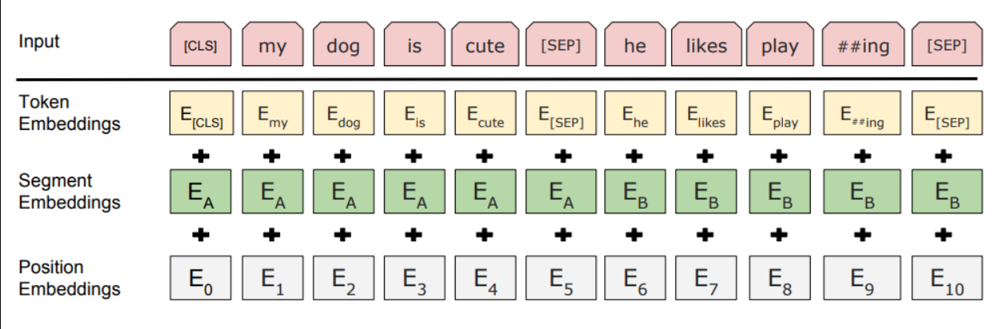

As you may know, the BERT model input is a combination of 3 embeddings.

* Token embeddings: WordPiece token vocabulary (WordPiece is another word segmentation algorithm, similar to BPE)
* Segment embeddings: for pair sentences [A-B] marked as $E_A$ or $E_B$ mean that it belongs to the first sentence or the second one.
* Position embeddings: specify the position of words in a sentence

## Installation

You can install the required libraries by the command below:

```bash
!pip install -q transformers torch scikit-learn dataclasses numpy filelock hazm clean-text[gpl] numba numpy torchtext torch torchvision pip install transformers[torch]
```

## Run

You can run the notebook on Colab, Kaggle or jupyter notebook.

Clone the project

```bash
  git clone https://github.com/MrAliAmani/ParsBERT-Sentiment-Analysis
```

## Results

ParsBERT obtains higher scores in all datasets, including existing ones as well as composed ones and improves the state-of-the-art performance by outperforming both multilingual BERT and other prior works in Sentiment Analysis, Text Classification and Named Entity Recognition tasks.

The evaluations of sentiment analysis (SA) on different datasets are shown below:

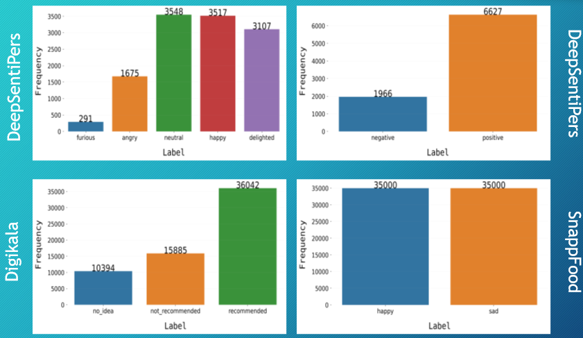

Text classification evaluations are shown in the figure below:

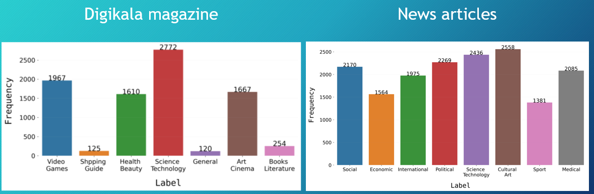

Named entity recognition (NER) evaluations are shown in the figure below:

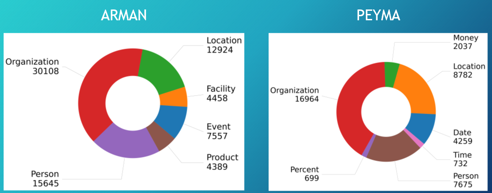

Here are the training and evaluation losses from the model history:

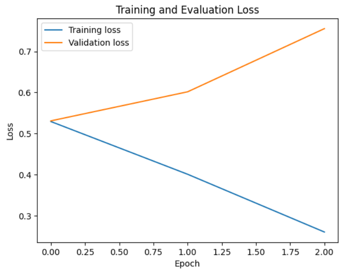

## Lessons Learned

## Citation

**[ParsBERT: Transformer-based Model for Persian Language Understanding](https://arxiv.org/abs/2005.12515)** paper from Mehrdad Farahani et al.
**[ParsBERT original repository](https://github.com/hooshvare/parsbert)**

## License

This project is under MIT license:

[](https://choosealicense.com/licenses/mit/)

## Feedback

If you have any feedback, please reach out to me at *<aliamani019@gmail.com>*.

## Authors

[@AliAmani](https://github.com/MrAliAmani)
